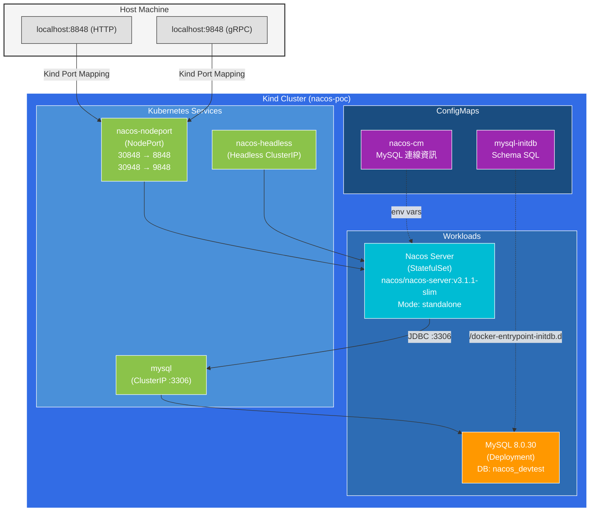
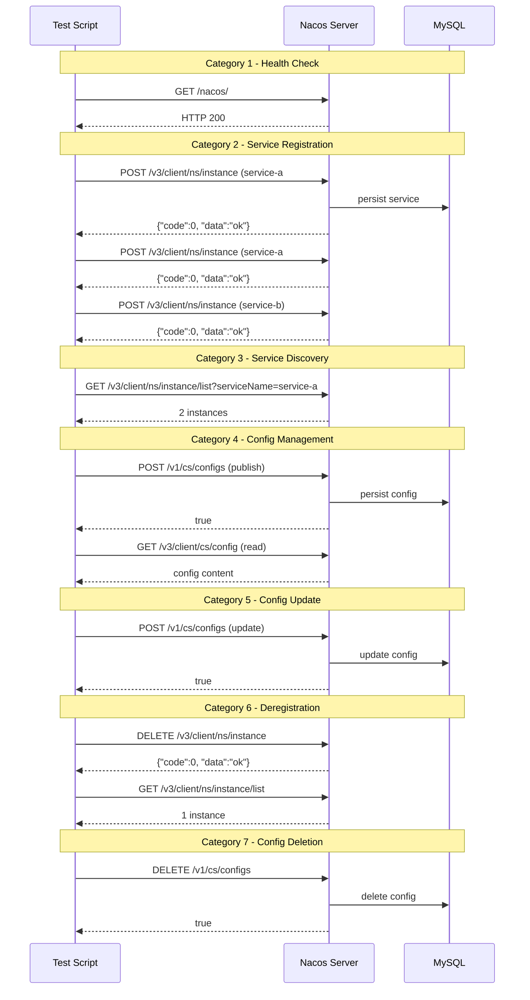
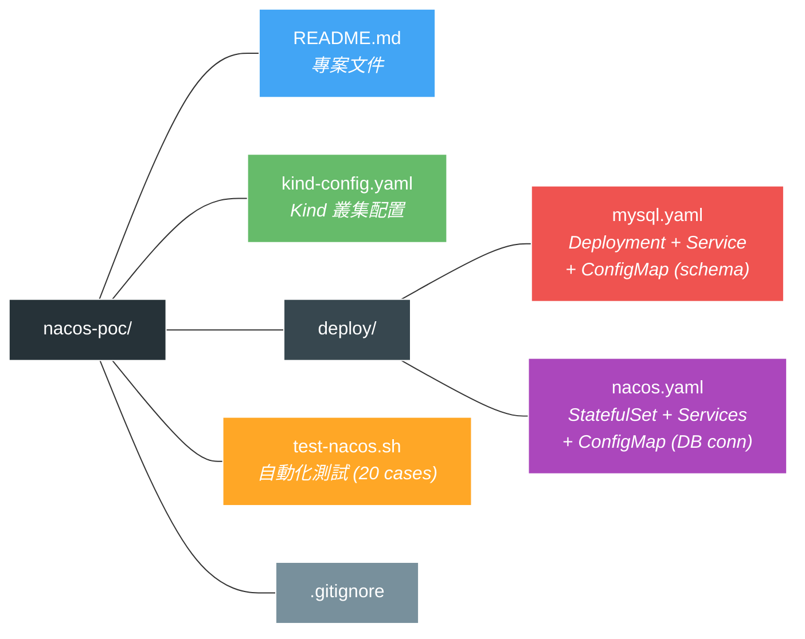

# Nacos on Kubernetes (Kind) PoC

本專案示範如何在本機使用 **Kind** (Kubernetes in Docker) 部署 **Nacos v3.1.1** 服務註冊與配置中心，並進行完整的功能驗證測試。

> 參考來源：[Nacos 官方 Kubernetes 快速開始](https://nacos.io/zh-cn/docs/quickstart/quick-start-kubernetes)

## 目錄

- [環境需求](#環境需求)
- [架構概覽](#架構概覽)
- [快速開始](#快速開始)
- [Phase 1：建立 Kind Cluster](#phase-1建立-kind-cluster)
- [Phase 2：部署 MySQL](#phase-2部署-mysql)
- [Phase 3：部署 Nacos](#phase-3部署-nacos)
- [Phase 4：功能測試](#phase-4功能測試)
- [測試案例與結果](#測試案例與結果)
- [Nacos API 速查表](#nacos-v31-api-速查表)
- [常見問題排除](#常見問題排除)
- [清理環境](#清理環境)

---

## 環境需求

| 工具 | 最低版本 | 用途 | 安裝方式 (macOS) |
|------|---------|------|------------------|
| Docker Desktop | 20.10+ | 容器執行環境 | [下載安裝](https://www.docker.com/products/docker-desktop/) |
| Kind | 0.20+ | 本機 K8s 叢集 | `brew install kind` |
| kubectl | 1.20+ | K8s CLI | `brew install kubectl` |
| curl | - | API 測試 | 系統內建 |

### 驗證環境

```bash
docker info --format '{{.ServerVersion}}'  # 確認 Docker 運行中
kind version                                # 確認 Kind 已安裝
kubectl version --client                    # 確認 kubectl 已安裝
```

---

## 架構概覽



### 元件說明

| 元件 | 類型 | 說明 |
|------|------|------|
| MySQL 8.0.30 | Deployment | Nacos 的持久化儲存後端，存放配置和服務資料 |
| Nacos v3.1.1 | StatefulSet | 服務註冊與配置中心，standalone 模式 |
| nacos-headless | Headless Service | Nacos Pod 間通訊用 (叢集模式需要) |
| nacos-nodeport | NodePort Service | 對外暴露 Nacos API 與 Console |
| nacos-cm | ConfigMap | MySQL 連線資訊 |
| mysql-initdb | ConfigMap | MySQL schema 初始化 SQL |

---

## 快速開始

如果你只想快速跑起來，執行以下命令：

```bash
# 1. 建立 Kind 叢集
kind create cluster --config kind-config.yaml

# 2. 部署 MySQL（等待 Ready）
kubectl apply -f deploy/mysql.yaml
kubectl wait --for=condition=Ready pod -l app=mysql --timeout=180s

# 3. 部署 Nacos（等待 Ready）
kubectl apply -f deploy/nacos.yaml
kubectl wait --for=condition=Ready pod -l app=nacos --timeout=300s

# 4. 等待 Nacos 完全啟動（約 15 秒）
sleep 15

# 5. 驗證
curl http://localhost:8848/nacos/

# 6. 執行測試
bash test-nacos.sh
```

---

## Phase 1：建立 Kind Cluster

### 1.1 Kind 配置檔說明

`kind-config.yaml`：

```yaml
kind: Cluster
apiVersion: kind.x-k8s.io/v1alpha4
name: nacos-poc
nodes:
  - role: control-plane
    extraPortMappings:
      - containerPort: 30848
        hostPort: 8848
        protocol: TCP
      - containerPort: 30948
        hostPort: 9848
        protocol: TCP
```

> **為什麼需要 `extraPortMappings`？**
>
> Kind 叢集運行在 Docker 容器中，預設無法從 host 直接存取 K8s 的 NodePort。
> 透過 `extraPortMappings`，我們將 Kind 容器的 30848 Port 映射到 host 的 8848，
> 這樣就能用 `localhost:8848` 存取 Nacos Console 和 API。

### 1.2 建立叢集

```bash
kind create cluster --config kind-config.yaml
```

### 1.3 驗證叢集

```bash
kubectl cluster-info --context kind-nacos-poc
kubectl get nodes
```

預期輸出：
```
NAME                      STATUS   ROLES           AGE   VERSION
nacos-poc-control-plane   Ready    control-plane   30s   v1.35.0
```

---

## Phase 2：部署 MySQL

### 2.1 MySQL 部署檔說明

`deploy/mysql.yaml` 包含三個 K8s 資源：

#### ConfigMap - MySQL Schema 初始化

Nacos 需要特定的資料庫表結構，我們透過 ConfigMap 掛載到 MySQL 的 `/docker-entrypoint-initdb.d`，
MySQL 啟動時會自動執行這些 SQL：

```yaml
apiVersion: v1
kind: ConfigMap
metadata:
  name: mysql-initdb
data:
  mysql-schema.sql: |
    CREATE TABLE `config_info` ( ... );      # 配置資訊
    CREATE TABLE `config_info_gray` ( ... );  # 灰度配置
    CREATE TABLE `config_tags_relation` ( ... );
    CREATE TABLE `group_capacity` ( ... );
    CREATE TABLE `his_config_info` ( ... );   # 配置歷史
    CREATE TABLE `tenant_capacity` ( ... );
    CREATE TABLE `tenant_info` ( ... );       # 租戶/命名空間
    CREATE TABLE `users` ( ... );             # 使用者認證
    CREATE TABLE `roles` ( ... );
    CREATE TABLE `permissions` ( ... );
```

#### Deployment - MySQL 服務

```yaml
apiVersion: apps/v1
kind: Deployment
metadata:
  name: mysql
spec:
  replicas: 1
  template:
    spec:
      containers:
        - name: mysql
          image: mysql:8.0.30
          args:
            - "--character-set-server=utf8mb4"
            - "--collation-server=utf8mb4_unicode_ci"
            - "--default-authentication-plugin=mysql_native_password"  # 重要！
          env:
            - name: MYSQL_ROOT_PASSWORD
              value: "root"
            - name: MYSQL_DATABASE
              value: "nacos_devtest"
            - name: MYSQL_USER
              value: "nacos"
            - name: MYSQL_PASSWORD
              value: "nacos"
```

> **重要：`--default-authentication-plugin=mysql_native_password`**
>
> MySQL 8.0 預設使用 `caching_sha2_password`，但 Nacos JDBC driver 不支援此認證方式，
> 會導致 `Public Key Retrieval is not allowed` 錯誤。必須切換為 `mysql_native_password`。

### 2.2 部署與驗證

```bash
# 部署
kubectl apply -f deploy/mysql.yaml

# 等待 Ready
kubectl wait --for=condition=Ready pod -l app=mysql --timeout=180s

# 驗證
kubectl get pods -l app=mysql
```

---

## Phase 3：部署 Nacos

### 3.1 Nacos 部署檔說明

`deploy/nacos.yaml` 包含四個 K8s 資源：

#### Headless Service

```yaml
apiVersion: v1
kind: Service
metadata:
  name: nacos-headless
spec:
  type: ClusterIP
  clusterIP: None           # Headless Service
  ports:
    - port: 8848            # HTTP API
    - port: 9848            # gRPC (client-rpc)
    - port: 9849            # Raft RPC (叢集同步)
    - port: 7848            # 舊版 Raft (1.4.x 相容)
```

> Headless Service 讓每個 Nacos Pod 有獨立的 DNS 記錄
> (如 `nacos-0.nacos-headless.default.svc.cluster.local`)，
> 叢集模式下 Pod 間需要透過此 DNS 互相發現。

#### NodePort Service

```yaml
apiVersion: v1
kind: Service
metadata:
  name: nacos-nodeport
spec:
  type: NodePort
  ports:
    - port: 8848
      nodePort: 30848       # 對應 Kind 的 hostPort 8848
    - port: 9848
      nodePort: 30948       # 對應 Kind 的 hostPort 9848
```

#### ConfigMap - 資料庫連線

```yaml
apiVersion: v1
kind: ConfigMap
metadata:
  name: nacos-cm
data:
  mysql.host: "mysql"       # K8s Service 名稱
  mysql.db.name: "nacos_devtest"
  mysql.port: "3306"
  mysql.user: "nacos"
  mysql.password: "nacos"
```

#### StatefulSet - Nacos Server

```yaml
apiVersion: apps/v1
kind: StatefulSet
metadata:
  name: nacos
spec:
  serviceName: nacos-headless
  replicas: 1               # PoC 使用 standalone 模式
  template:
    spec:
      containers:
        - name: nacos
          image: nacos/nacos-server:v3.1.1-slim
          env:
            - name: MODE
              value: "standalone"
            - name: SPRING_DATASOURCE_PLATFORM
              value: "mysql"
            - name: NACOS_AUTH_ENABLE
              value: "false"
            # NACOS_AUTH_TOKEN 即使 auth 關閉也必須設定
            - name: NACOS_AUTH_TOKEN
              value: "SecretKey01234..."
```

> **為什麼使用 StatefulSet 而非 Deployment？**
>
> StatefulSet 提供穩定的網路標識 (`nacos-0`, `nacos-1`...)，
> 這在叢集模式下很重要，因為 Nacos 節點需要透過固定 hostname 互相通訊。
> 即使 standalone 模式也建議使用 StatefulSet，方便後續擴展。

> **為什麼 `NACOS_AUTH_TOKEN` 即使關閉 Auth 也要設定？**
>
> Nacos v3.1.1 的啟動腳本會檢查 `NACOS_AUTH_TOKEN` 環境變數，
> 如果未設定會直接報錯退出，不論 `NACOS_AUTH_ENABLE` 是否為 false。

### 3.2 部署與驗證

```bash
# 部署
kubectl apply -f deploy/nacos.yaml

# 等待 Ready
kubectl wait --for=condition=Ready pod -l app=nacos --timeout=300s

# 驗證 Pod 狀態
kubectl get pods -o wide

# 驗證 Nacos Console（需等待約 10-15 秒啟動完成）
curl -s http://localhost:8848/nacos/
```

### 3.3 存取 Nacos Console

部署完成後，在瀏覽器開啟：

```
http://localhost:8848/nacos/
```

---

## Phase 4：功能測試

### 執行自動化測試

```bash
bash test-nacos.sh
```

### 手動測試範例

#### 服務註冊 (v3 API)

```bash
# 註冊一個服務實例
curl -X POST 'http://localhost:8848/nacos/v3/client/ns/instance' \
  -d 'serviceName=my-service&ip=10.0.0.1&port=8080&weight=1&enabled=true&healthy=true&ephemeral=true'
```

#### 服務發現 (v3 API)

```bash
# 查詢服務實例列表
curl 'http://localhost:8848/nacos/v3/client/ns/instance/list?serviceName=my-service'
```

#### 配置發佈 (v1 API)

```bash
# 發佈配置（v3 Client API 設計上不提供 publish 接口）
curl -X POST 'http://localhost:8848/nacos/v1/cs/configs' \
  -d 'dataId=app.properties&group=DEFAULT_GROUP&content=server.port=8080'
```

#### 配置讀取 (v3 API)

```bash
# 讀取配置
curl 'http://localhost:8848/nacos/v3/client/cs/config?dataId=app.properties&groupName=DEFAULT_GROUP'
```

#### 服務反註冊 (v3 API)

```bash
# 移除服務實例
curl -X DELETE 'http://localhost:8848/nacos/v3/client/ns/instance?serviceName=my-service&ip=10.0.0.1&port=8080&ephemeral=true'
```

---

## 測試案例與結果

### 測試流程



### 測試總覽

| # | 分類 | 測試案例 | API 版本 | 結果 |
|---|------|---------|---------|------|
| 1 | Health Check | Nacos Console 可存取性 | HTTP | PASS |
| 2 | Service Registration | 註冊 service-a instance 1 | v3 | PASS |
| 3 | Service Registration | 註冊 service-a instance 2 | v3 | PASS |
| 4 | Service Registration | 註冊 service-b | v3 | PASS |
| 5 | Service Discovery | 查詢 service-a 實例 (預期 2) | v3 | PASS |
| 6 | Service Discovery | 查詢 service-b 實例 (預期 1) | v3 | PASS |
| 7 | Service Discovery | 列出所有服務 | v1 | PASS |
| 8 | Config Management | 發佈 properties 配置 | v1 | PASS |
| 9 | Config Management | 發佈 YAML 配置 | v1 | PASS |
| 10 | Config Management | 讀取 properties (v3 驗證) | v3 | PASS |
| 11 | Config Management | 讀取 properties (v1 交叉驗證) | v1 | PASS |
| 12 | Config Management | 讀取 YAML 配置 | v3 | PASS |
| 13 | Config Update | 更新配置內容 | v1 | PASS |
| 14 | Config Update | 驗證更新後的配置 | v3 | PASS |
| 15 | Deregistration | 反註冊 service-a instance 2 | v3 | PASS |
| 16 | Deregistration | 驗證反註冊後實例數 | v3 | PASS |
| 17 | Config Deletion | 刪除配置 | v1 | PASS |
| 18 | Config Deletion | 驗證刪除後查詢回傳 20004 | v3 | PASS |
| 19 | Cleanup | 清理剩餘配置 | v1 | PASS |
| 20 | Cleanup | 清理剩餘服務實例 | v3 | PASS |

**結果：20/20 (100%) 通過**

### 測試輸出範例

<details>
<summary>點擊展開完整測試輸出</summary>

```
========================================
  Nacos PoC Test Suite (v3.1.1)
  Target: http://localhost:8848/nacos
========================================

--- Category 1: Health Check ---
[TEST 1] Nacos Console Accessibility
  PASS: Nacos Console responds HTTP 200

--- Category 2: Service Registration ---
[TEST 2] Register service-a instance 1 (192.168.1.10:8080)
  Response: {"code":0,"message":"success","data":"ok"}
  PASS: service-a instance 1 registered

[TEST 3] Register service-a instance 2 (192.168.1.11:8080)
  Response: {"code":0,"message":"success","data":"ok"}
  PASS: service-a instance 2 registered

--- Category 3: Service Discovery ---
[TEST 5] Discover service-a instances (expect 2)
  PASS: Found 2 instances of service-a

--- Category 4: Configuration Management ---
[TEST 8] Publish config: app.properties (v1 API)
  Response: true
  PASS: app.properties published

[TEST 10] Read config: app.properties (v3 Client API)
  Response: server.port=8080
  PASS: Config content verified via v3 API

========================================
  Test Summary
========================================
  Total:  20
  Pass:   20
  Fail:   0
  Rate:   100%
========================================
```

</details>

---

## Nacos v3.1 API 速查表

### v3 Client API (應用程式使用)

| 操作 | Method | Endpoint | 說明 |
|------|--------|----------|------|
| 服務註冊 | POST | `/nacos/v3/client/ns/instance` | 註冊/心跳 |
| 服務反註冊 | DELETE | `/nacos/v3/client/ns/instance` | 移除實例 |
| 服務發現 | GET | `/nacos/v3/client/ns/instance/list` | 查詢實例列表 |
| 讀取配置 | GET | `/nacos/v3/client/cs/config` | 讀取配置內容 |

### v1 API (管理操作)

| 操作 | Method | Endpoint | 說明 |
|------|--------|----------|------|
| 發佈配置 | POST | `/nacos/v1/cs/configs` | 建立/更新配置 |
| 讀取配置 | GET | `/nacos/v1/cs/configs` | 讀取配置 |
| 刪除配置 | DELETE | `/nacos/v1/cs/configs` | 刪除配置 |
| 服務列表 | GET | `/nacos/v1/ns/service/list` | 列出所有服務 |

> **注意**：Nacos v3.1 的 Client API 設計上**不提供**配置發佈和刪除接口。
> 官方建議應用程式僅作為配置的消費者，配置的發佈/刪除應透過管理 API (Admin API) 或 Console 操作。

### 常用參數

| 參數 | 說明 | 範例 |
|------|------|------|
| `serviceName` | 服務名稱 | `my-service` |
| `ip` | 實例 IP | `192.168.1.10` |
| `port` | 實例 Port | `8080` |
| `dataId` | 配置 ID | `app.properties` |
| `groupName` (v3) / `group` (v1) | 群組名稱 | `DEFAULT_GROUP` |
| `namespaceId` | 命名空間 ID | `public` |
| `ephemeral` | 臨時實例 | `true` |

---

## 常見問題排除

### 1. Nacos Pod CrashLoopBackOff：Public Key Retrieval

**症狀**：
```
Caused by: com.mysql.cj.exceptions.CJException: Public Key Retrieval is not allowed
```

**原因**：MySQL 8.0 預設使用 `caching_sha2_password`，Nacos 不支援。

**解法**：在 MySQL 啟動參數加入：
```yaml
args:
  - "--default-authentication-plugin=mysql_native_password"
```

### 2. Nacos 啟動失敗：NACOS_AUTH_TOKEN must be set

**症狀**：
```
env NACOS_AUTH_TOKEN must be set with Base64 String.
```

**原因**：Nacos v3.1.1 要求 `NACOS_AUTH_TOKEN` 必須設定，即使 `NACOS_AUTH_ENABLE=false`。

**解法**：始終設定這三個環境變數：
```yaml
- name: NACOS_AUTH_TOKEN
  value: "SecretKey012345678901234567890123456789012345678901234567890123456789"
- name: NACOS_AUTH_IDENTITY_KEY
  value: "serverIdentity"
- name: NACOS_AUTH_IDENTITY_VALUE
  value: "security"
```

### 3. 服務註冊成功但 Discovery 查不到

**症狀**：Register API 回傳 `{"code":0}`，但 Instance List 回傳空陣列。

**原因**：Ephemeral 實例需要短暫時間傳播。

**解法**：等待 2-3 秒後再查詢。

### 4. v1 API 回傳 410 Gone

**症狀**：
```json
{"status":410,"message":"Current API will be deprecated, please use API(s) ..."}
```

**原因**：Nacos v3.1 部分 v1 Console API 已棄用。

**解法**：改用提示中的 v3 API，或在 `application.properties` 設定
`nacos.core.api.compatibility.console.enabled=true`。

### 5. localhost:8848 連不上

**排查步驟**：
```bash
# 1. 確認 Kind 叢集正常
kubectl get nodes

# 2. 確認 Pod 運行中
kubectl get pods

# 3. 確認 NodePort Service 存在
kubectl get svc nacos-nodeport

# 4. 查看 Nacos 日誌
kubectl logs nacos-0 --tail=50

# 5. 測試 Pod 內部連線
kubectl exec -it nacos-0 -- curl localhost:8848/nacos/
```

---

## 清理環境

```bash
# 刪除 K8s 資源
kubectl delete -f deploy/nacos.yaml
kubectl delete -f deploy/mysql.yaml

# 刪除 Kind 叢集
kind delete cluster --name nacos-poc
```

---

## 專案結構


